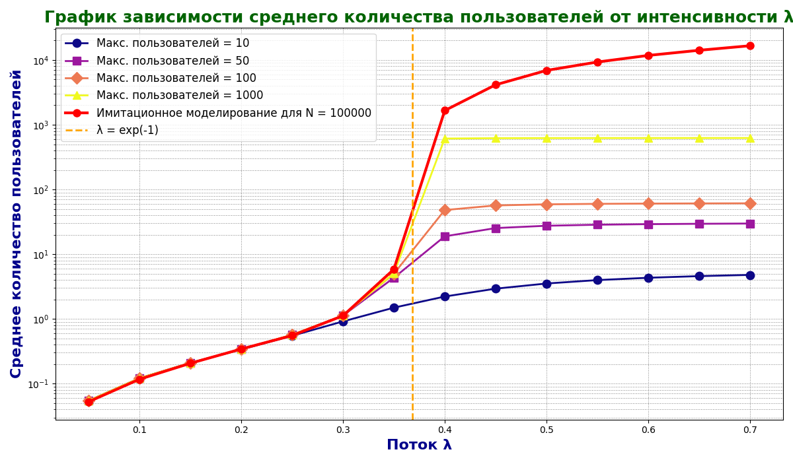

# Лабораторная работа № 2. Марковская модель системы множественного доступа

## Содержание

1. [Цель работы](#цель-работы)
2. [Математическая модель](#математическая-модель)
3. [Реализация](#реализация)
4. [Результаты](#результаты)
5. [Вывод](#вывод)
6. [Запуск программы](#запуск-программы)

## Цель работы

Проанализировать элементарную систему множественного доступа с помощью Марковской цепи, получить стационарное распределение состояний и оценить среднее количество абонентов при различной интенсивности входного потока $\lambda$.

## Задачи

- Реализация вероятностной модели с использованием закона распределения Пуассона.
- Вычисление вероятностей переходов между состояниями системы.
- Генерация и анализ матрицы переходных состояний.
- Имитационное моделирование для различных параметров.
- Визуализация результатов в виде графиков зависимости количества пользователей от интенсивности потока.

## Математическая модель

Состояние Марковской цепи равно количеству активных абонентов, имеющих сообщения для передачи. Поступление новых сообщений описывается распределением Пуассона:

$$
P\{A=j\}=\frac{\lambda^j e^{-\lambda}}{j!}.
$$

Если в системе находится $i$ абонентов, каждый передаёт с вероятностью $1/i$. Вероятность успешной передачи ровно одного сообщения равна

$$
P_{\text{успех}}(i)=\left(1-\frac{1}{i}\right)^{i-1}.
$$

Из вероятностей появления новых сообщений и успешной передачи формируется матрица переходов $P$. Стационарное распределение $\boldsymbol{\pi}$ определяется условиями

$$
\boldsymbol{\pi}P=\boldsymbol{\pi}, \qquad \sum_i \pi_i=1,
$$

а среднее количество абонентов вычисляется как $\overline{N}=\sum_i i\pi_i$.

## Реализация

Программа [Lab2.py](Lab2.py) объединяет аналитический расчёт и имитационное моделирование.

### `ProbabilityModel`
Класс, реализующий вероятностную модель системы. Основные методы:
- `calculate_probability(i)`: вычисляет вероятность передачи сообщений.
- `poisson_distribution(j)`: вычисляет вероятности Пуассона для количества абонентов.
- `probability_to_stay(i)`: вероятность остаться в текущем состоянии.
- `probability_from_i_to_j(i, j)`: вероятность перехода из состояния `i` в `j`.

### `process_data(lambda_val, slot_count)`
Функция для моделирования работы системы на основе случайного процесса появления сообщений.

### `transition_matrix(lambda_val, max_users)`
Генерация матрицы переходов и вычисление стационарного распределения вероятностей.

### `plot_results(lambda_values, avg_results, max_users_values, simulation_results)`
Функция для построения графиков зависимости среднего количества пользователей от интенсивности потока.

Расчёт выполняется для $\lambda$ от 0,05 до 0,70. Аналитическая модель исследуется при ограничениях пространства состояний $K = 10, 50, 100, 1000$, а имитационная модель — на 100 000 слотах.

## Результаты



*Рисунок 1 — сравнение аналитического расчёта при различных значениях $K$ с имитационным моделированием.*

График показывает следующие закономерности:

- при $\lambda < e^{-1}$ результаты моделей близки, а среднее число абонентов растёт плавно;
- около $\lambda = e^{-1}$ начинается переход к перегруженному режиму;
- при $\lambda > e^{-1}$ имитационная модель демонстрирует быстрое накопление абонентов;
- в усечённых Марковских моделях рост ограничивается выбранным числом состояний $K$, поэтому кривые выходят на плато;
- увеличение $K$ отодвигает влияние искусственного ограничения и точнее описывает рост очереди.

## Вывод

Марковская и имитационная модели согласованно описывают устойчивый режим системы при малой нагрузке. После критической точки $\lambda = e^{-1}$ очередь начинает быстро расти. Усечение пространства состояний позволяет решить систему линейных уравнений численно, но при высокой нагрузке ограничивает среднее число абонентов и создаёт искусственное плато. Поэтому для анализа перегруженного режима необходимо выбирать достаточно большое $K$ или использовать имитационную модель.

## Запуск программы

Требуются Python 3.7 или новее, `numpy`, `matplotlib` и `scipy`.

```bash
pip install -r requirements.txt
python Lab2.py
```

После завершения программа выводит рассчитанные значения в консоль и сохраняет график в `lambda_plot.png`.

## Состав каталога

| Файл | Назначение |
|---|---|
| [Lab2.py](Lab2.py) | Аналитическая и имитационная модели |
| [requirements.txt](requirements.txt) | Список зависимостей |
| [lambda_plot.png](lambda_plot.png) | Итоговый сравнительный график |
| [Лаб2_отчёт.docx](Лаб2_отчёт.docx) | Оформленный отчёт по лабораторной работе |

